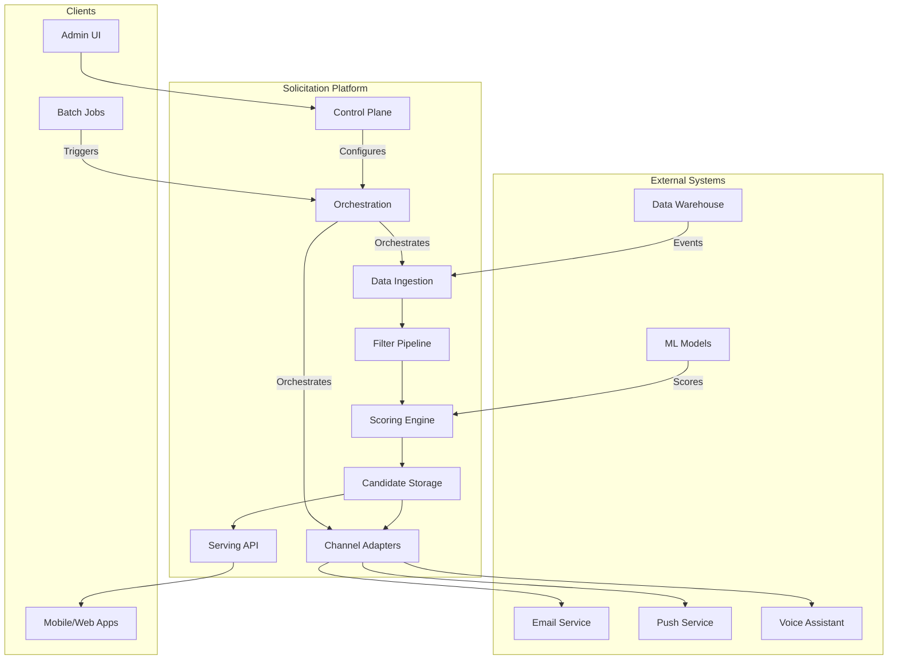

# Design Document

## Overview

The General Solicitation Platform is a cloud-native, event-driven system built on AWS that enables flexible customer response solicitation across multiple product verticals. The platform supports soliciting any type of customer engagement (reviews, ratings, surveys, participation requests, content contributions, poll responses) through a modular, plugin-based architecture where data sources, scoring models, filtering rules, and notification channels can be added or modified without changing core platform logic.

### Key Design Principles

1. **Separation of Concerns**: Each layer (ingestion, scoring, filtering, storage, serving, delivery) operates independently with well-defined interfaces
2. **Extensibility**: Plugin architecture for data connectors, scoring providers, filters, and channel adapters
3. **Performance**: Optimized for low-latency serving (P99 < 30ms) and high-throughput batch processing (10M+ candidates/day)
4. **Reliability**: Graceful degradation, circuit breakers, and fallback strategies for dependency failures
5. **Observability**: Comprehensive metrics, structured logging, and distributed tracing throughout

### High-Level Architecture

The platform consists of nine major subsystems:

1. **Data Ingestion Layer**: Abstracts data source integration via pluggable connectors
2. **Scoring Engine Layer**: Decouples ML model execution from workflow logic
3. **Filtering & Eligibility Layer**: Configurable pipeline for business rules and validation
4. **Candidate Storage Layer**: Scalable DynamoDB-based repository with GSIs
5. **Serving Layer**: Low-latency API for candidate retrieval
6. **Notification Channel Layer**: Extensible framework for multi-channel delivery
7. **Workflow Orchestration Layer**: Step Functions for batch and reactive workflows
8. **Configuration & Control Plane**: Centralized program and feature management
9. **Observability Layer**: Metrics, logging, alarms, and dashboards


## Architecture

### System Context Diagram



### Data Flow

**Batch Ingestion Flow:**
1. Scheduled EventBridge rule triggers Step Functions workflow
2. ETL Lambda reads from data warehouse via data connector
3. Filter Lambda applies eligibility and business rules
4. Scoring Lambda retrieves features and computes scores
5. Storage Lambda writes candidates to DynamoDB in batches
6. Completion Lambda exports snapshot to data warehouse

**Reactive Solicitation Flow:**
1. Customer event published to EventBridge
2. Event triggers reactive Lambda function
3. Lambda applies filters and scoring in parallel
4. Eligible candidate written to DynamoDB immediately
5. Candidate available for serving within 1 second

**Serving Flow:**
1. Client calls GetCandidatesForCustomer API
2. API Gateway routes to serving Lambda
3. Lambda queries DynamoDB by customer+program+channel
4. Optional: Real-time eligibility refresh
5. Ranking logic applied to candidates
6. Response returned with P99 < 30ms

**Channel Delivery Flow:**
1. Scheduled EventBridge rule triggers channel workflow
2. Channel Lambda queries candidates by program+channel
3. Channel adapter formats and delivers via external service
4. Delivery status and metrics recorded
5. Delivered candidates marked as consumed


## Components and Interfaces

### 1. Data Connector Interface

```typescript
interface DataConnector {
  // Metadata about this connector
  getName(): string;
  getVersion(): string;
  getSourceSchema(): Schema;
  
  // Configuration and validation
  validateConfig(config: ConnectorConfig): ValidationResult;
  
  // Data extraction
  extractData(config: ConnectorConfig, dateRange: DateRange): AsyncIterator<RawRecord>;
  
  // Transformation to unified model
  transformToCandidate(record: RawRecord, config: ConnectorConfig): Candidate;
}

interface ConnectorConfig {
  sourceId: string;
  tableName: string;
  fieldMappings: Map<string, string>;
  filterRules: FilterRule[];
  partitionKeys: string[];
}

interface RawRecord {
  fields: Map<string, any>;
  metadata: RecordMetadata;
}
```

**Implementation Notes:**
- Base abstract class provides common validation and error handling
- Concrete implementations for data warehouse tables, Kinesis streams, S3 files
- Schema validation using JSON Schema or similar
- Transformation pipeline supports custom functions via Lambda


### 2. Scoring Provider Interface

```typescript
interface ScoringProvider {
  // Metadata
  getModelId(): string;
  getModelVersion(): string;
  getRequiredFeatures(): string[];
  
  // Scoring operations
  scoreCandidate(candidate: Candidate, features: FeatureMap): Promise<Score>;
  scoreBatch(candidates: Candidate[], features: FeatureMap[]): Promise<Score[]>;
  
  // Health and fallback
  healthCheck(): Promise<HealthStatus>;
  getFallbackScore(candidate: Candidate): Score;
}

interface Score {
  modelId: string;
  value: number;
  confidence: number;
  timestamp: string; // ISO8601
  metadata?: Map<string, any>;
}

interface FeatureMap {
  customerId: string;
  subjectId: string;
  features: Map<string, FeatureValue>;
}
```

**Implementation Notes:**
- Supports both synchronous (SageMaker endpoint) and asynchronous (batch transform) scoring
- Feature store integration via separate service
- Score caching in DynamoDB with TTL
- Circuit breaker pattern for model endpoint failures
- Fallback to cached scores or default values


### 3. Filter Interface

```typescript
interface Filter {
  // Metadata
  getFilterId(): string;
  getFilterType(): FilterType; // TRUST, ELIGIBILITY, BUSINESS_RULE, QUALITY, CAPACITY
  
  // Filtering operation
  filter(candidates: Candidate[], context: FilterContext): Promise<FilterResult>;
  
  // Configuration
  configure(config: FilterConfig): void;
}

interface FilterResult {
  passed: Candidate[];
  rejected: RejectedCandidate[];
  metrics: FilterMetrics;
}

interface RejectedCandidate {
  candidate: Candidate;
  reason: string;
  reasonCode: string;
  timestamp: string;
}

interface FilterContext {
  programId: string;
  marketplace: string;
  executionId: string;
  timestamp: string;
}

enum FilterType {
  TRUST = "TRUST",
  ELIGIBILITY = "ELIGIBILITY",
  BUSINESS_RULE = "BUSINESS_RULE",
  QUALITY = "QUALITY",
  CAPACITY = "CAPACITY"
}
```

**Implementation Notes:**
- Filter chain executor orchestrates multiple filters
- Filters can run in parallel where dependencies allow
- Rejection reasons tracked for observability and debugging
- Each filter is stateless and idempotent
- Filters can call external services (with circuit breakers)


### 4. Channel Adapter Interface

```typescript
interface ChannelAdapter {
  // Metadata
  getChannelId(): string;
  getChannelType(): ChannelType; // EMAIL, IN_APP, PUSH, VOICE, SMS
  
  // Delivery operations
  deliver(candidates: Candidate[], context: DeliveryContext): Promise<DeliveryResult>;
  
  // Configuration and health
  configure(config: ChannelConfig): void;
  healthCheck(): Promise<HealthStatus>;
  
  // Shadow mode support
  isShadowMode(): boolean;
}

interface DeliveryResult {
  delivered: DeliveredCandidate[];
  failed: FailedDelivery[];
  metrics: DeliveryMetrics;
}

interface DeliveredCandidate {
  candidate: Candidate;
  deliveryId: string;
  timestamp: string;
  channelMetadata?: Map<string, any>;
}

interface DeliveryContext {
  programId: string;
  marketplace: string;
  campaignId?: string;
  shadowMode: boolean;
}

enum ChannelType {
  EMAIL = "EMAIL",
  IN_APP = "IN_APP",
  PUSH = "PUSH",
  VOICE = "VOICE",
  SMS = "SMS"
}
```

**Implementation Notes:**
- Email adapter integrates with campaign management service
- In-app/push/voice adapters expose serving API endpoints
- Shadow mode logs intended deliveries without actual sends
- Rate limiting and frequency capping per channel
- Template management per program and channel


### 5. Serving API

```typescript
interface ServingAPI {
  // Primary serving endpoint
  getCandidatesForCustomer(request: GetCandidatesRequest): Promise<GetCandidatesResponse>;
  
  // Batch serving
  getCandidatesForCustomers(request: BatchGetCandidatesRequest): Promise<BatchGetCandidatesResponse>;
  
  // Channel-specific queries
  getCandidatesForChannel(request: ChannelQueryRequest): Promise<ChannelQueryResponse>;
  
  // Eligibility refresh
  refreshCandidateEligibility(request: RefreshRequest): Promise<RefreshResponse>;
}

interface GetCandidatesRequest {
  customerId: string;
  channel?: string;
  program?: string;
  limit?: number;
  includeScores?: boolean;
  refreshEligibility?: boolean;
}

interface GetCandidatesResponse {
  candidates: Candidate[];
  metadata: ResponseMetadata;
  latencyMs: number;
}

interface ResponseMetadata {
  totalCount: number;
  filteredCount: number;
  cacheHit: boolean;
  eligibilityRefreshed: boolean;
}
```

**Implementation Notes:**
- API Gateway with Lambda integration
- DynamoDB query optimization using GSIs
- Response caching at API Gateway level (short TTL)
- Channel-specific ranking algorithms
- A/B testing integration for treatment assignment
- Circuit breakers for eligibility refresh calls


## Data Models

### Candidate Model

```typescript
interface Candidate {
  // Primary identifiers
  customerId: string;
  context: Context[];
  subject: Subject;
  
  // Scoring
  scores: Map<string, Score>;
  
  // Attributes
  attributes: CandidateAttributes;
  
  // Metadata
  metadata: CandidateMetadata;
  
  // History
  rejectionHistory?: RejectionRecord[];
}

interface Context {
  type: string; // "marketplace", "program", "vertical"
  id: string;
}

interface Subject {
  type: string; // "product", "video", "track", "service", "event", "experience", "content"
  id: string;
  metadata?: Map<string, any>;
}

interface CandidateAttributes {
  eventDate: string; // ISO8601
  deliveryDate?: string; // ISO8601
  timingWindow?: string; // ISO8601
  orderValue?: number;
  mediaEligible?: boolean;
  channelEligibility: Map<string, boolean>;
}

interface CandidateMetadata {
  createdAt: string; // ISO8601
  updatedAt: string; // ISO8601
  expiresAt: string; // ISO8601
  version: number;
  sourceConnectorId: string;
  workflowExecutionId: string;
}

interface RejectionRecord {
  filterId: string;
  reason: string;
  reasonCode: string;
  timestamp: string;
}
```


### DynamoDB Schema

**Primary Table: Candidates**

```
Primary Key: 
  PK: CUSTOMER#{customerId}#PROGRAM#{programId}#MARKETPLACE#{marketplaceId}
  SK: SUBJECT#{subjectType}#{subjectId}

Attributes:
  - context (List of Maps)
  - subject (Map)
  - scores (Map)
  - attributes (Map)
  - metadata (Map)
  - rejectionHistory (List)
  - ttl (Number, for automatic expiration)

GSI-1 (ProgramChannelIndex):
  PK: PROGRAM#{programId}#CHANNEL#{channelId}
  SK: SCORE#{scoreValue}#CUSTOMER#{customerId}
  
GSI-2 (ProgramDateIndex):
  PK: PROGRAM#{programId}#DATE#{YYYY-MM-DD}
  SK: CREATED#{timestamp}#CUSTOMER#{customerId}
```

**Rationale:**
- Primary key enables efficient customer queries
- GSI-1 supports channel-specific candidate selection with score-based sorting
- GSI-2 enables date-range queries for analytics and batch processing
- TTL attribute enables automatic cleanup of expired candidates
- Composite sort keys enable flexible query patterns

**Capacity Planning:**
- On-demand capacity mode for variable workloads
- Estimated 100M items across all programs
- Average item size: 2KB
- Read capacity: 10K RPS peak (serving API)
- Write capacity: 5K RPS peak (batch ingestion)


### Configuration Models

**Program Configuration**

```typescript
interface ProgramConfig {
  programId: string;
  programName: string;
  enabled: boolean;
  marketplaces: string[];
  
  // Data sources
  dataConnectors: DataConnectorConfig[];
  
  // Scoring
  scoringModels: ScoringModelConfig[];
  
  // Filtering
  filterChain: FilterChainConfig;
  
  // Channels
  channels: ChannelConfig[];
  
  // Scheduling
  batchSchedule?: CronExpression;
  reactiveEnabled: boolean;
  
  // Lifecycle
  candidateTTLDays: number;
  timingWindowDays?: number;
  
  // Experimentation
  experiments?: ExperimentConfig[];
}

interface FilterChainConfig {
  filters: FilterConfig[];
  parallelExecution: boolean;
  failFast: boolean;
}

interface FilterConfig {
  filterId: string;
  filterType: FilterType;
  enabled: boolean;
  parameters: Map<string, any>;
  order: number;
}
```

**Data Source Registry**

```typescript
interface DataSourceRegistration {
  sourceId: string;
  connectorType: string;
  connectorVersion: string;
  config: ConnectorConfig;
  enabled: boolean;
  programs: string[]; // Programs using this source
  lastRefresh?: string;
  healthStatus: HealthStatus;
}
```


## Correctness Properties

*A property is a characteristic or behavior that should hold true across all valid executions of a system—essentially, a formal statement about what the system should do. Properties serve as the bridge between human-readable specifications and machine-verifiable correctness guarantees.*

### Data Transformation and Model Properties

**Property 1: Data connector transformation preserves semantics**

*For any* valid source record and data connector configuration, transforming the record to the unified candidate model and then extracting the original fields should yield equivalent values to the source record.

**Validates: Requirements 1.2**

**Property 2: Candidate model completeness**

*For any* candidate stored in the system, it must contain all required fields: customerId, context array (with at least one context), subject, metadata with timestamps, and version number.

**Validates: Requirements 2.1, 2.2**

**Property 3: Context extensibility**

*For any* valid context type and id combination, the candidate model must be able to store it in the context array without data loss.

**Validates: Requirements 1.3, 2.3**

**Property 4: Version monotonicity**

*For any* candidate, if it is updated, the new version number must be strictly greater than the previous version number, and the updatedAt timestamp must be greater than or equal to the previous updatedAt timestamp.

**Validates: Requirements 2.5**


### Scoring and Feature Properties

**Property 5: Multi-model scoring independence**

*For any* candidate and set of scoring models, each model must be able to produce a score independently, and all scores must be stored with their respective modelId, value, confidence, and timestamp.

**Validates: Requirements 3.3**

**Property 6: Score caching consistency**

*For any* candidate and scoring model, if a score is computed and cached, retrieving the cached score within the TTL period must return the same score value and confidence.

**Validates: Requirements 3.5**

**Property 7: Scoring fallback correctness**

*For any* candidate, if scoring fails for any reason, the system must either return a cached score (if available and not expired) or a configured fallback score, and must log the failure.

**Validates: Requirements 3.4, 9.3**

**Property 8: Feature retrieval completeness**

*For any* scoring request, all features listed in the scoring provider's required features must be retrieved from the feature store before scoring is attempted.

**Validates: Requirements 3.2**


### Filtering and Eligibility Properties

**Property 9: Filter chain ordering**

*For any* configured filter chain, filters must execute in the exact order specified by their order numbers, and each filter must receive the output of the previous filter as input.

**Validates: Requirements 4.1**

**Property 10: Rejection tracking completeness**

*For any* candidate rejected by any filter, the rejection must be recorded with the filterId, reason, reasonCode, and timestamp, and the candidate must not proceed to storage.

**Validates: Requirements 4.2, 4.6**

**Property 11: Eligibility marking**

*For any* candidate that passes all filters in the filter chain, it must be marked as eligible and proceed to storage with no rejection records.

**Validates: Requirements 4.4**


### Storage and Retrieval Properties

**Property 12: Storage round-trip consistency**

*For any* valid candidate, storing it in Candidate_Storage and then retrieving it by its primary key (customerId, programId, marketplaceId, subjectType, subjectId) must return a candidate with equivalent field values.

**Validates: Requirements 5.2, 2.1**

**Property 13: Query filtering correctness**

*For any* query with program and/or channel filters, all returned candidates must match the specified program and channel criteria, and no candidates matching the criteria should be omitted (up to the query limit).

**Validates: Requirements 5.3, 6.2**

**Property 14: Optimistic locking conflict detection**

*For any* two concurrent updates to the same candidate, at least one must fail with a conflict error, and the successful update must have a version number exactly one greater than the previous version.

**Validates: Requirements 5.5**

**Property 15: Batch write atomicity**

*For any* batch of candidates, either all candidates in the batch are written successfully, or none are written (or partial writes are clearly identified and retried).

**Validates: Requirements 5.2**

**Property 16: Data warehouse export completeness**

*For any* daily export, all candidates created or updated during that day must appear in the export, and no candidates from other days should be included.

**Validates: Requirements 5.6**


### Serving API Properties

**Property 17: Channel-specific ranking consistency**

*For any* set of candidates for a customer and channel, applying the channel-specific ranking algorithm multiple times with the same input must produce the same ordering.

**Validates: Requirements 6.3**

**Property 18: Eligibility refresh correctness**

*For any* candidate, if real-time eligibility refresh is requested and the candidate is stale (older than threshold), the system must re-validate eligibility and update the candidate's eligibility status.

**Validates: Requirements 6.4**

**Property 19: Serving API fallback behavior**

*For any* serving request, if dependencies fail (scoring, eligibility checks), the API must return cached or stale results (if available) and log the degradation, rather than failing the request.

**Validates: Requirements 6.5**

**Property 20: Batch query correctness**

*For any* batch query with multiple customerIds, the response must contain results for each customerId, and results for one customer must not be mixed with results for another customer.

**Validates: Requirements 6.6**


### Channel Delivery Properties

**Property 21: Channel adapter interface compliance**

*For any* registered channel adapter, it must implement the required interface methods (deliver, configure, healthCheck, isShadowMode) and return results in the expected format.

**Validates: Requirements 7.1**

**Property 22: Delivery status tracking**

*For any* delivery attempt, the channel adapter must return a delivery status (delivered or failed) for each candidate, along with delivery metadata.

**Validates: Requirements 7.3**

**Property 23: Shadow mode non-delivery**

*For any* channel adapter in shadow mode, calling deliver must log the intended delivery but must not actually send notifications to customers.

**Validates: Requirements 7.5, 14.5**

**Property 24: Rate limiting queue behavior**

*For any* channel adapter, if rate limits are exceeded, candidates must be queued for later delivery, and no candidates should be dropped.

**Validates: Requirements 7.6**


### Workflow and Orchestration Properties

**Property 25: Workflow retry with exponential backoff**

*For any* workflow step that fails, retries must occur with exponentially increasing delays (e.g., 1s, 2s, 4s, 8s) up to the configured maximum retry count.

**Validates: Requirements 8.3**

**Property 26: Workflow metrics publishing**

*For any* workflow execution, metrics must be published at each stage (ETL, filtering, scoring, storage) including counts of processed, passed, and rejected candidates.

**Validates: Requirements 8.4, 12.1**

**Property 27: Workflow completion triggers**

*For any* workflow that completes successfully, completion metrics must be published and any configured downstream processes must be triggered.

**Validates: Requirements 8.6**

**Property 28: Reactive candidate creation**

*For any* eligible customer event in reactive mode, a candidate must be created and stored, and the candidate must be available for serving immediately after storage.

**Validates: Requirements 9.4**

**Property 29: Event deduplication within window**

*For any* customer and subject, if multiple events occur within the configured deduplication window, only one candidate should be created.

**Validates: Requirements 9.5**


### Configuration and Program Management Properties

**Property 30: Program configuration validation**

*For any* program configuration, all required fields (programId, dataConnectors, filterChain, channels) must be present and valid, or the configuration must be rejected with detailed error messages.

**Validates: Requirements 10.1**

**Property 31: Program configuration completeness**

*For any* valid program configuration, it must specify at least one data source, one filter, one scoring model, and one channel.

**Validates: Requirements 10.2**

**Property 32: Program disable enforcement**

*For any* disabled program, no new candidates should be created, and all scheduled workflows for that program should be skipped.

**Validates: Requirements 10.3**

**Property 33: Marketplace configuration override**

*For any* program with marketplace-specific overrides, the override configuration must take precedence over the default program configuration for that marketplace.

**Validates: Requirements 10.4**


### Experimentation Properties

**Property 34: Deterministic treatment assignment**

*For any* customer and experiment, the assigned treatment group must be deterministic (same customer always gets same treatment) and stable across multiple requests.

**Validates: Requirements 11.1**

**Property 35: Treatment recording**

*For any* candidate created during an active experiment, the assigned treatment must be recorded in the candidate metadata.

**Validates: Requirements 11.3**

**Property 36: Treatment-specific metrics collection**

*For any* experiment, metrics must be collected separately for each treatment group, enabling comparison of treatment performance.

**Validates: Requirements 11.4**


### Observability Properties

**Property 37: Structured logging with correlation**

*For any* workflow or API request, all log entries must include a correlation ID, and failures must emit structured logs with error details.

**Validates: Requirements 12.2**

**Property 38: Rejection reason aggregation**

*For any* time period, rejection reasons must be aggregated by filter type and reason code, enabling analysis of why candidates are being rejected.

**Validates: Requirements 12.3**


### Multi-Program Isolation Properties

**Property 39: Program failure isolation**

*For any* program workflow failure, other programs' workflows must continue executing normally without being affected by the failure.

**Validates: Requirements 13.1**

**Property 40: Program-specific throttling**

*For any* program that exceeds its rate limits, only that program should be throttled, and other programs should continue operating at their normal rates.

**Validates: Requirements 13.3**

**Property 41: Program cost attribution**

*For any* resource usage (storage, compute, API calls), costs must be attributed to the specific program that generated the usage.

**Validates: Requirements 13.4**


### Email Channel Properties

**Property 42: Email campaign automation**

*For any* set of email candidates selected for delivery, a campaign must be created automatically with the correct program template and recipient list.

**Validates: Requirements 14.1**

**Property 43: Program-specific email templates**

*For any* email delivery, the template used must match the program configuration, and different programs must be able to use different templates.

**Validates: Requirements 14.2**

**Property 44: Opt-out enforcement**

*For any* customer who has opted out of emails, they must be excluded from all email campaigns, regardless of program.

**Validates: Requirements 14.3**

**Property 45: Email frequency capping**

*For any* customer, the number of emails sent within a configured time window must not exceed the frequency cap.

**Validates: Requirements 14.4**

**Property 46: Email delivery tracking**

*For any* email campaign sent, delivery status and open rates must be tracked and recorded for each recipient.

**Validates: Requirements 14.6**


### Real-Time Channel Properties

**Property 47: Personalized ranking with context**

*For any* real-time channel request, the ranking algorithm must use customer context (history, preferences, behavior) to personalize the candidate ordering.

**Validates: Requirements 15.4**

**Property 48: Treatment-specific candidate serving**

*For any* serving request during an active A/B test, the returned candidates must match the customer's assigned treatment group.

**Validates: Requirements 15.5**


### Data Quality and Validation Properties

**Property 49: Required field validation**

*For any* data ingestion, records with missing or null required fields must be rejected, and detailed validation errors must be logged.

**Validates: Requirements 16.1, 16.3**

**Property 50: Date format validation**

*For any* date field in ingested data, it must be in ISO8601 format and within reasonable ranges (e.g., not in the distant past or future), or the record must be rejected.

**Validates: Requirements 16.2, 16.3**


### Candidate Lifecycle Properties

**Property 51: TTL configuration**

*For any* candidate created, the TTL must be set according to the program's candidateTTLDays configuration, calculated from the creation timestamp.

**Validates: Requirements 17.1**

**Property 52: Manual deletion**

*For any* candidate, calling the delete API must remove the candidate from storage, and subsequent queries for that candidate must return not found.

**Validates: Requirements 17.3**

**Property 53: Consumed marking**

*For any* candidate that is delivered, if the program is configured to mark consumed candidates, the candidate must be marked as consumed with a delivery timestamp.

**Validates: Requirements 17.4**

**Property 54: Candidate refresh**

*For any* active candidate, if re-scoring or eligibility refresh is triggered, the candidate's scores and eligibility status must be updated with current values.

**Validates: Requirements 17.5**


### Security and Compliance Properties

**Property 55: PII redaction in logs**

*For any* log entry containing customer data, PII fields (email, phone, address) must be redacted or masked before the log is written.

**Validates: Requirements 18.4**

**Property 56: Opt-out candidate deletion**

*For any* customer opt-out request, all candidates associated with that customer must be deleted within 24 hours.

**Validates: Requirements 18.5**

**Property 57: Email compliance**

*For any* email sent, it must include an unsubscribe link, and the email must respect the customer's frequency preferences.

**Validates: Requirements 18.6**


### Migration and Backward Compatibility Properties

**Property 58: V1 API backward compatibility**

*For any* v1 API request, the system must return a valid v1 response format, even though the backend uses v2 implementation.

**Validates: Requirements 20.1**

**Property 59: V1 usage tracking**

*For any* v1 API request, usage metrics must be recorded including endpoint, customer, and timestamp to support migration planning.

**Validates: Requirements 20.3**

**Property 60: Shadow mode isolation**

*For any* request in shadow mode, v2 processing must execute in parallel with v1, but v2 results must not affect the v1 response returned to the client.

**Validates: Requirements 20.4**


## Error Handling

### Error Categories

**1. Validation Errors**
- Invalid input data (missing fields, wrong types, out-of-range values)
- Schema validation failures
- Configuration errors
- **Handling**: Reject immediately, log detailed error, return 400 Bad Request

**2. Dependency Failures**
- Data warehouse unavailable
- ML model endpoint timeout
- Feature store errors
- External service failures (email, push)
- **Handling**: Circuit breaker pattern, fallback to cached data, retry with exponential backoff, degrade gracefully

**3. Resource Exhaustion**
- DynamoDB throttling
- Lambda timeout
- Memory limits exceeded
- Rate limits hit
- **Handling**: Exponential backoff, queue for later processing, alert operators

**4. Business Logic Errors**
- Candidate already exists
- Program disabled
- Customer opted out
- Eligibility check failed
- **Handling**: Log reason, track metrics, return appropriate status code

**5. System Errors**
- Unexpected exceptions
- Data corruption
- Infrastructure failures
- **Handling**: Log with full context, alert on-call, fail safe (don't lose data)


### Error Handling Patterns

**Circuit Breaker Pattern**
- Applied to: ML model calls, feature store, external services
- States: Closed (normal), Open (failing), Half-Open (testing recovery)
- Thresholds: 50% error rate over 10 requests triggers open
- Recovery: After 30 seconds, attempt one request to test recovery

**Retry with Exponential Backoff**
- Applied to: DynamoDB throttling, transient failures, workflow steps
- Strategy: 1s, 2s, 4s, 8s, 16s delays
- Max retries: 5 attempts
- Jitter: Add random 0-1s to prevent thundering herd

**Graceful Degradation**
- Serving API: Return cached candidates if real-time scoring fails
- Scoring: Use fallback scores if model unavailable
- Filtering: Skip optional filters if they timeout
- Channels: Queue for later if rate limited

**Dead Letter Queues**
- All async workflows have DLQ for failed messages
- DLQ messages trigger alarms after threshold
- Manual replay tools for DLQ processing

**Idempotency**
- All write operations use idempotency tokens
- Duplicate requests within 24 hours return cached response
- Prevents duplicate candidate creation from retries


## Testing Strategy

### Dual Testing Approach

The platform requires both unit tests and property-based tests to ensure comprehensive correctness:

- **Unit tests**: Verify specific examples, edge cases, and error conditions
- **Property-based tests**: Verify universal properties across all inputs
- Both are complementary and necessary for comprehensive coverage

Unit tests are helpful for specific examples and edge cases, but we should avoid writing too many unit tests since property-based tests handle covering lots of inputs. Unit tests should focus on:
- Specific examples that demonstrate correct behavior
- Integration points between components
- Edge cases and error conditions

Property tests should focus on:
- Universal properties that hold for all inputs
- Comprehensive input coverage through randomization

### Property-Based Testing Configuration

**Testing Framework**: Use **fast-check** for TypeScript/JavaScript or **Hypothesis** for Python

**Test Configuration**:
- Minimum 100 iterations per property test (due to randomization)
- Each property test must reference its design document property
- Tag format: **Feature: solicitation-platform, Property {number}: {property_text}**
- Each correctness property must be implemented by a SINGLE property-based test


### Testing Layers

**1. Unit Tests**

**Data Connectors**
- Test schema validation with valid and invalid schemas
- Test field mapping with various source formats
- Test transformation logic with edge cases (null values, missing fields)
- Test error handling for malformed data

**Scoring Engine**
- Test feature retrieval with missing features
- Test score caching with various TTL scenarios
- Test fallback logic when models fail
- Test concurrent scoring requests

**Filter Chain**
- Test filter ordering with various configurations
- Test rejection tracking with multiple filters
- Test parallel execution where applicable
- Test filter failures and error handling

**Storage Layer**
- Test CRUD operations with valid and invalid data
- Test query operations with various filter combinations
- Test optimistic locking with concurrent updates
- Test TTL setting and expiration

**Serving API**
- Test request validation with invalid inputs
- Test ranking algorithms with various candidate sets
- Test caching behavior with cache hits and misses
- Test error responses for various failure scenarios

**Channel Adapters**
- Test delivery with valid and invalid candidates
- Test shadow mode behavior
- Test rate limiting and queueing
- Test template rendering with various data


**2. Property-Based Tests**

Each of the 60 correctness properties defined above must have a corresponding property-based test. Examples:

**Property 1: Data connector transformation preserves semantics**
```typescript
// Feature: solicitation-platform, Property 1: Data connector transformation preserves semantics
fc.assert(
  fc.property(
    arbitrarySourceRecord(),
    arbitraryConnectorConfig(),
    (sourceRecord, config) => {
      const candidate = connector.transformToCandidate(sourceRecord, config);
      const extractedFields = extractOriginalFields(candidate, config);
      return deepEqual(extractedFields, sourceRecord.fields);
    }
  ),
  { numRuns: 100 }
);
```

**Property 12: Storage round-trip consistency**
```typescript
// Feature: solicitation-platform, Property 12: Storage round-trip consistency
fc.assert(
  fc.property(
    arbitraryCandidate(),
    async (candidate) => {
      await storage.store(candidate);
      const retrieved = await storage.get(
        candidate.customerId,
        candidate.programId,
        candidate.marketplaceId,
        candidate.subject.type,
        candidate.subject.id
      );
      return deepEqual(retrieved, candidate);
    }
  ),
  { numRuns: 100 }
);
```

**Property 34: Deterministic treatment assignment**
```typescript
// Feature: solicitation-platform, Property 34: Deterministic treatment assignment
fc.assert(
  fc.property(
    arbitraryCustomerId(),
    arbitraryExperimentConfig(),
    (customerId, experiment) => {
      const treatment1 = assignTreatment(customerId, experiment);
      const treatment2 = assignTreatment(customerId, experiment);
      return treatment1 === treatment2;
    }
  ),
  { numRuns: 100 }
);
```


**3. Integration Tests**

**End-to-End Batch Workflow**
- Test complete batch ingestion flow from data warehouse to storage
- Verify all workflow steps execute in correct order
- Test error handling and retry logic
- Verify metrics are published at each stage

**End-to-End Reactive Workflow**
- Test event-driven candidate creation
- Verify sub-second latency from event to storage
- Test deduplication logic
- Verify candidate availability for serving

**Serving API Integration**
- Test API with real DynamoDB backend
- Test with various query patterns and filters
- Test caching behavior with real cache
- Test error scenarios with dependency failures

**Channel Delivery Integration**
- Test email campaign creation with real email service (in test mode)
- Test in-app serving with real API calls
- Test shadow mode end-to-end
- Verify delivery tracking and metrics

**4. Performance Tests**

**Serving API Latency**
- Load test with 10K RPS
- Measure P50, P90, P99 latencies
- Target: P99 < 30ms
- Test with various query patterns

**Batch Throughput**
- Test ingestion of 10M+ candidates
- Measure end-to-end processing time
- Target: Complete within 4 hours
- Test with various program configurations

**Storage Scalability**
- Test with 100M+ candidates in DynamoDB
- Measure query performance at scale
- Test GSI query patterns
- Verify auto-scaling behavior

**5. Chaos Engineering**

**Dependency Failures**
- Simulate data warehouse unavailability
- Simulate ML model timeouts
- Simulate DynamoDB throttling
- Verify graceful degradation

**Resource Exhaustion**
- Simulate Lambda memory limits
- Simulate API Gateway throttling
- Simulate network partitions
- Verify error handling and recovery

